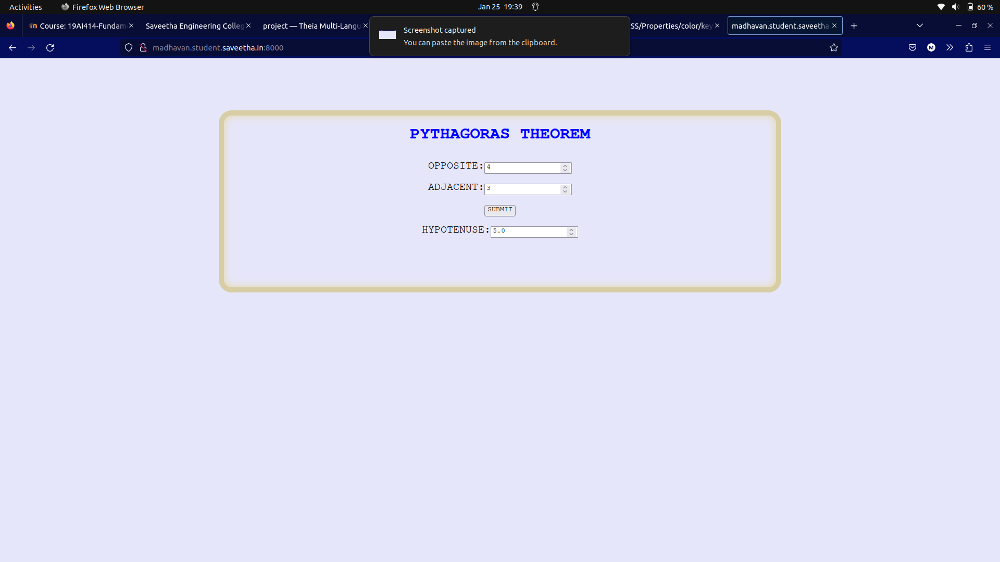

# Design a Website for Server Side Processing

# AIM:

To design a website to perform mathematical calculations in server side.

# DESIGN STEPS:

## Step 1:
Create a new django project and app.


## Step 2:
Make on changes in settings and create templates folder.


## Step 3:
Create a code for frontend of calculation using HTML and CSS and save it in templates


## Step 4:
Give an url mapping and write a python code for calculation in views.


## Step 5:
Take a screenshot of the site and upload it.


# PROGRAM:
home.html:
```
<!DOCTYPE html>
<html>
<head>
    <title></title>

</head>

<style>
    *{
        box-sizing: border-box;
        font-family: Courier;
        
    }

    body{ background-color: lavender;
    
    
    }

    .container{
    width: 1080px;
    height: 350px;
    margin-top: 100px;
    margin-left: auto;
    margin-right: auto;
    border-radius: 25px;
    border: 10px solid rgb(216, 206, 165);
    box-shadow: inset 0 0 15px rgb(231, 217, 160);
    
    }
    h1{

        color:blue;
        font-family:Courier;
        text-align: center;
    }
    .calculate{
        padding-top: 10px;
        padding-bottom: 10px;
        padding-left: 10px;
        padding-right:10px;
        text-align: center;
        font-size: 20px;
        padding-top: 7px;
        font-family: Courier;
        color:"red"
    }

</style>
<body>
    <div class="container">
        <h1>PYTHAGORAS THEOREM</h1>

        <form method="POST">
            

            <div class="calculate">
                OPPOSITE:<input type="number" name="OPPOSITE" value={{b}}></input><br/>
            </div>
            <div class="calculate">
                ADJACENT:<input type="number" name="ADJACENT" value={{a}}></input><br/>
            </div>
            <div class="calculate">
                <input type="submit" value="SUBMIT"></input><br/>
            </div>
            <div class="calculate"> 
                HYPOTENUSE:<input type="number" name="hypotenuse" value={{c}}></input>
            </div>
        </form>
    </div>
</body>
</html>
```
views.py:
```
from django.shortcuts import render
def home(request):
    context = {}
    context["a"] = ''
    context["b"] = ''
    context["c"] = ''
    if request.method == 'POST':
        a = request.POST.get('ADJACENT', '')
        b = request.POST.get('OPPOSITE', '')

        c=int(a)**2+int(b)**2
        c=c**0.5
        context['c'] = c
        context['a'] = a
        context['b'] =b

    return render(request, "cal/home.html", context)
```
urls.py:
```
from django.contrib import admin
from django.urls import path
from mathapp import views


urlpatterns = [
    path('admin/', admin.site.urls),
    path('home/',views.home,name="home"),
    path('',views.home ,name="mathapp")
]
```

# OUTPUT:


# RESULT:

The program is executed succesfully
